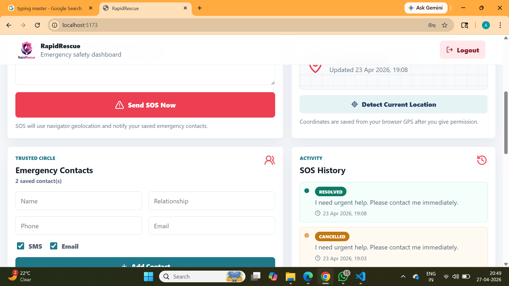

# Rapid Rescue

Emergency response platform designed to help users during accidents and urgent situations.

## Preview

## Features

- Emergency SOS alerts
- Trusted contact notifications
- Live location support
- Quick help access
- Safety-focused user experience

## Tech Stack

- React.js
- JavaScript
- OpenStreetMap
- HTML
- CSS

## Purpose

Rapid Rescue was created to improve emergency response by enabling faster alerts, better communication, and location-based assistance.

## Status

Prototype / In Development

## Author

Adhfar Nabi

